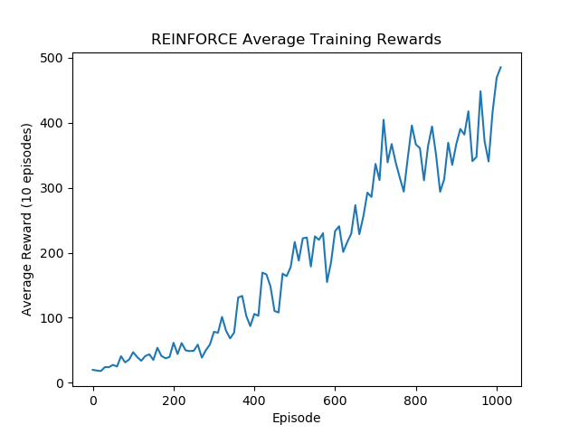
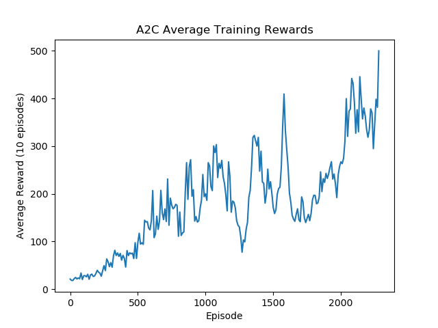
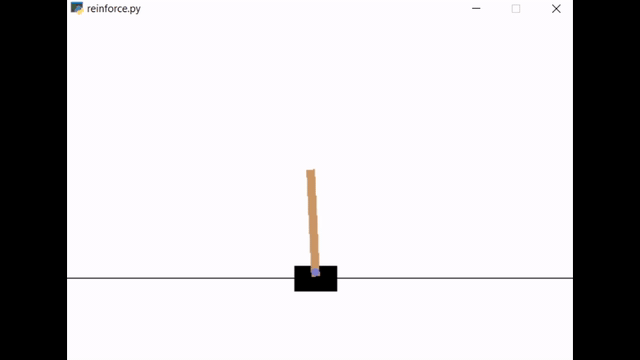
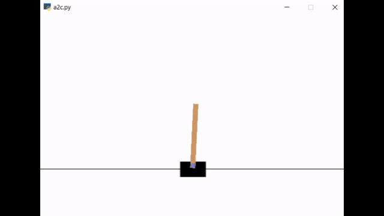
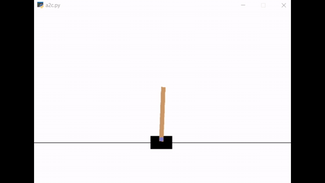

# Deep Reinforcement Learning

I present an implementation, investigation, and comparison into two policy-based reinforcement learning methods: REINFORCE and Advantage Actor Critic (A2C).  The algorithms are evaluated using the OpenAI Gym CartPole-v1 environment and find both agents proficient at the task - capable of flawless performance in the classic control problem when acting on their respective optimal policies after training.  I show that REINFORCE experiences more efficient policy learning and offer the explanation that the complexity of training an additional network in A2C for the relatively simple and discrete CartPole task necessitates additional training.

## Overview 

REINFORCE and A2C policy-based reinforcement learning implementations in OpenAI Gym CartPole-v1 environment.  Algorithms designed to share actor across implementations and add additional critic to approximate value function.

Agents trained until proficiency was achieved - deemed proficient after average reward over 10 episodes exceeded environment reward threshold.  Final evaluation performed by following optimal policy (rather than probabilistic exploration) for 100 episodes.

See report and presentation under resources for a more in-depth analysis of the implementation of each algorithm and results. 

## Results

REINFORCE Average Training Rewards until Proficient:

A2C Average Training Rewards until Proficient:

REINFORCE Episode 0

A2C Episode 0

REINFORCE once Proficient

A2C once Proficient

